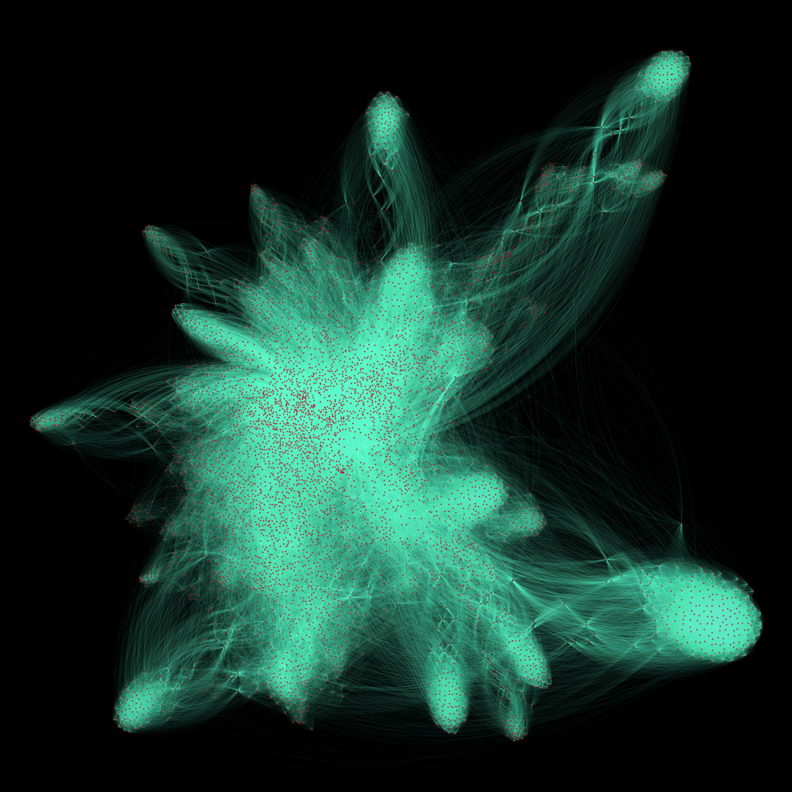
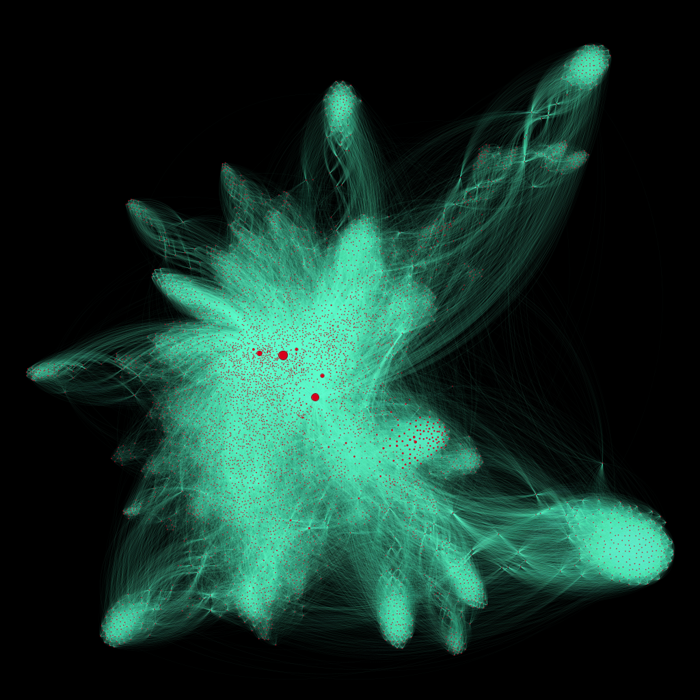
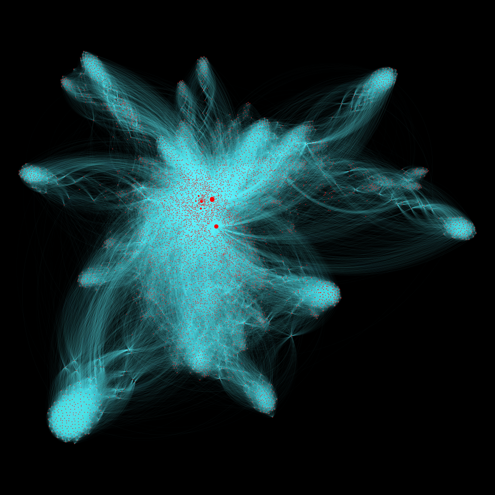

# Page-Rank
Page Runk written on C++ with OpenMP

---

[//]: # ([![Build Status]&#40;https://github.com/danila12315454/HW-Card-Game/actions/workflows/CI.yml/badge.svg&#41;]&#40;https://github.com/danila12315454/HW-Card-Game/actions/workflows/CI.yml/badge.svg&#41;)
[//]: # ([![Qodana Status]&#40;https://img.shields.io/badge/Qodana-Passed-green?logo=quizlet&#41;]&#40;https://github.com/danila12315454/HW-Card-Game/actions?query=workflow%3AQodana&#41;)

---

# Table of contents

---

## 1. [How to run](assets/HowToRun.md)

## 2. [Algorithm Description](assets/AlgorithmDescription.md)

## 3. [Task Definition](assets/TaskDefinition.md)

## 4. [Paralleling Algorithm](assets/ParallelingAlgorithm.md)

---

# Here you can see graph of pages before PageRank algorithm.
## You can try looking on this graph in svg [UnRankedNodes](assets/images/UnRankedNodes.svg).

---

# Here you can see graph of pages after PageRank algorithm.
## You can try looking on this graph in svg [RankedNodes](assets/images/RankedNodes.svg).

---

# Here you can see graph of pages after montecarlo PageRank algorithm.
## You can try looking on this graph in svg [MontecarloRankedNodes](assets/images/MontecarloRankedNodes.svg).
