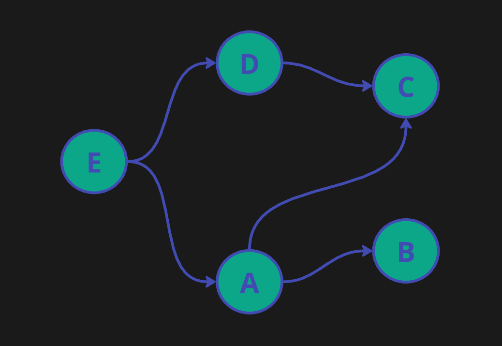
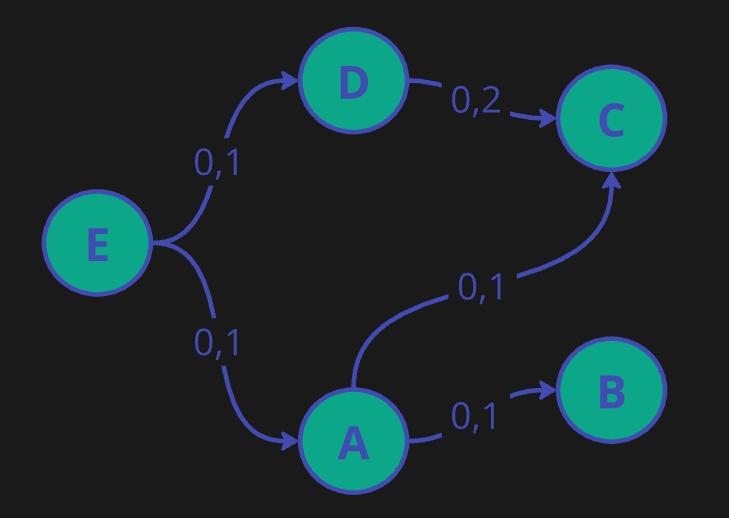
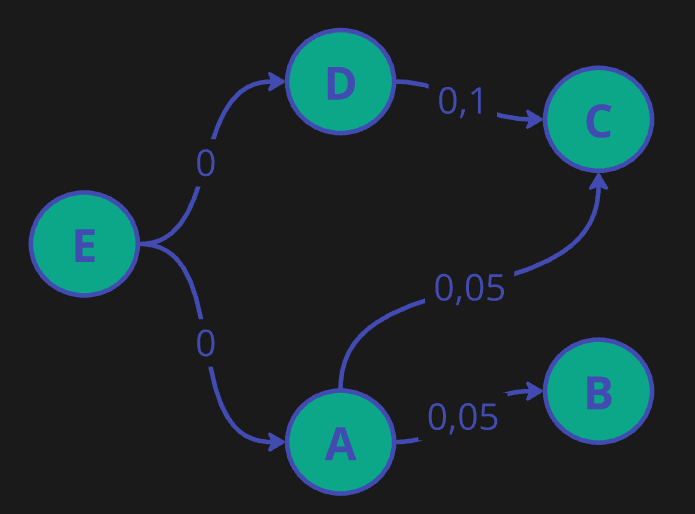

[Back to Readme](../README.md)

# Page-Rank Algorithm

## Main idea of this algorithm

### Main idea of this algorithm is to rank web pages by their importance. The importance of a page is determined by the number of links pointing to it. The more links a page has, the more important it is. The algorithm is based on the idea that important pages are likely to be linked to by other important pages. The algorithm works by assigning each page a rank based on the number of links pointing to it, and then iteratively updating the ranks of the pages based on the ranks of the pages linking to them.

## Now let's talk about the algorithm in more simple words.

### Let's think about it as a table of weights of the pages. Each iteration is calculating new row in this table.

### Imagine we have graph of pages looking like that.



### Now let's create table, it will look like that.

| Page | Iteration 0 | Iteration 1 | Iteration 1 | ... |
|------|-------------|-------------|-------------|-----|
| A    |             |             |             | ... |
| B    |             |             |             | ... |
| C    |             |             |             | ... |
| D    |             |             |             | ... |
| E    |             |             |             | ... |

### Now let's fill the first iteration. We will fill it with 1/N where N is number of pages. This is done since we need some starting point. So our case it will be 1/5 = 0.2

## Values for the first iteration:

### $$PR(P_i) = \frac{1}{N} $$

| Page | Iteration 0 | Iteration 1 | Iteration 1 | ... |
|------|-------------|-------------|-------------|-----|
| A    | 0.2         |             |             | ... |
| B    | 0.2         |             |             | ... |
| C    | 0.2         |             |             | ... |
| D    | 0.2         |             |             | ... |
| E    | 0.2         |             |             | ... |

### Now let's fill the second iteration. We will fill it with formula:

### $$PR(P_i) = \sum_{P_j \in M(P_i)} \left( \frac{PR(P_j)}{L(P_j)} \right) $$

## Where:

- $PR(P_i)$ - PageRank value for Page number i
- $N$ - Total amount of pages in network
- $M(P_i)$ - set of pages that are linked to the page $P_i$
- $PR(P_j)$ - PageRank value for Page number j that is linked to page $P_i$
- $L(P_i)$ - amount of links coming from page $P_j$

### Let's calculate the second iteration.

### Here you can see values for connections between pages.



| Page | Iteration 0 | Iteration 1 | Iteration 1 | ... |
|------|-------------|-------------|-------------|-----|
| A    | 0.2         | 0.1         |             | ... |
| B    | 0.2         | 0.1         |             | ... |
| C    | 0.2         | 0.1 + 0.2   |             | ... |
| D    | 0.2         | 0.1         |             | ... |
| E    | 0.2         | 0           |             | ... |

### Now let's calculate the third iteration.


| Page | Iteration 0 | Iteration 1 | Iteration 1 | ... |
|------|-------------|-------------|-------------|-----|
| A    | 0.2         | 0.1         | 0           | ... |
| B    | 0.2         | 0.1         | 0.05        | ... |
| C    | 0.2         | 0.1 + 0.2   | 0.15        | ... |
| D    | 0.2         | 0.1         | 0           | ... |
| E    | 0.2         | 0           | 0           | ... |

### Making more iterations will make the values more accurate.

# Now lets talk about our realisation of this algorithm.
### We started from creating a structure to store information about node(page).
### It has this fields:
```cpp
string name; // Name of the node
long double prev_value; // value of the node in previous iteration
long double real_value; // value of the node in current iteration
vector<Node *> parents; // vector of pointers to the parent nodes
uint32_t children_number; // amount of children
```
### Also, each node has a method to calculate its value in the next iteration and a method to move the value from real_value to prev_value.
### When we created this feature we started to implement the main algorithm. It will go as simple as running recalculate method for each node in the graph and then runing step method for each node in the graph.